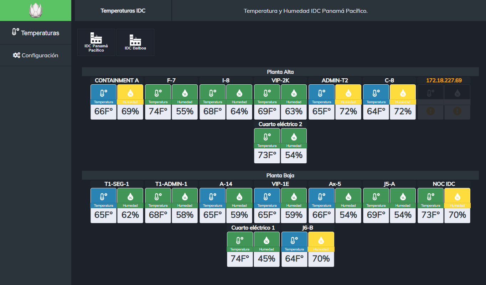
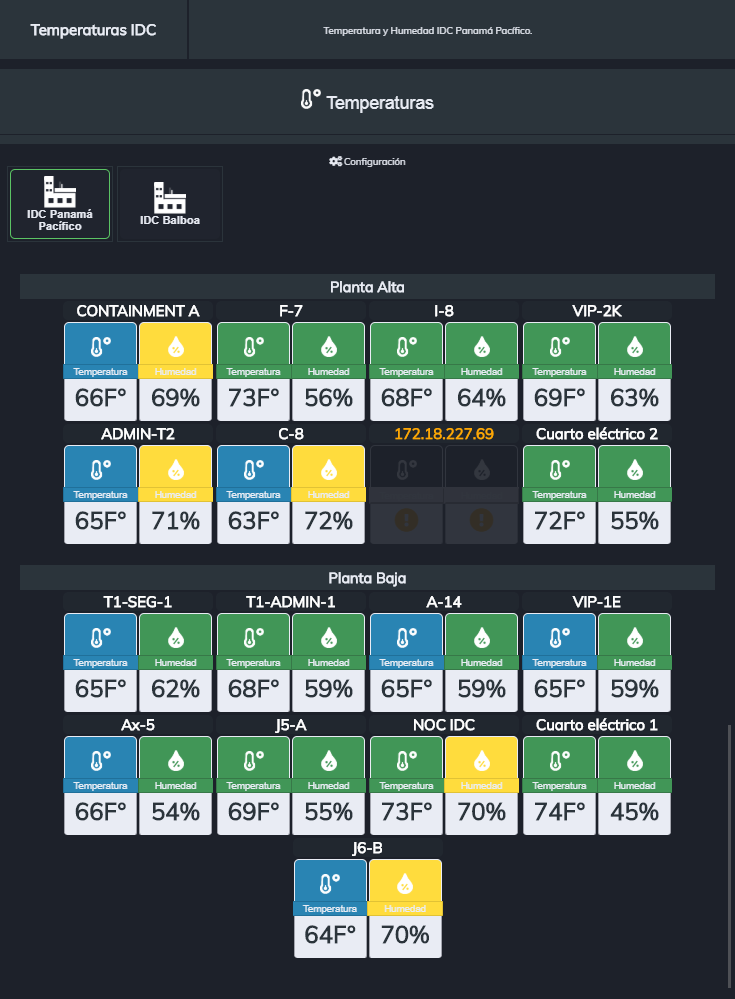
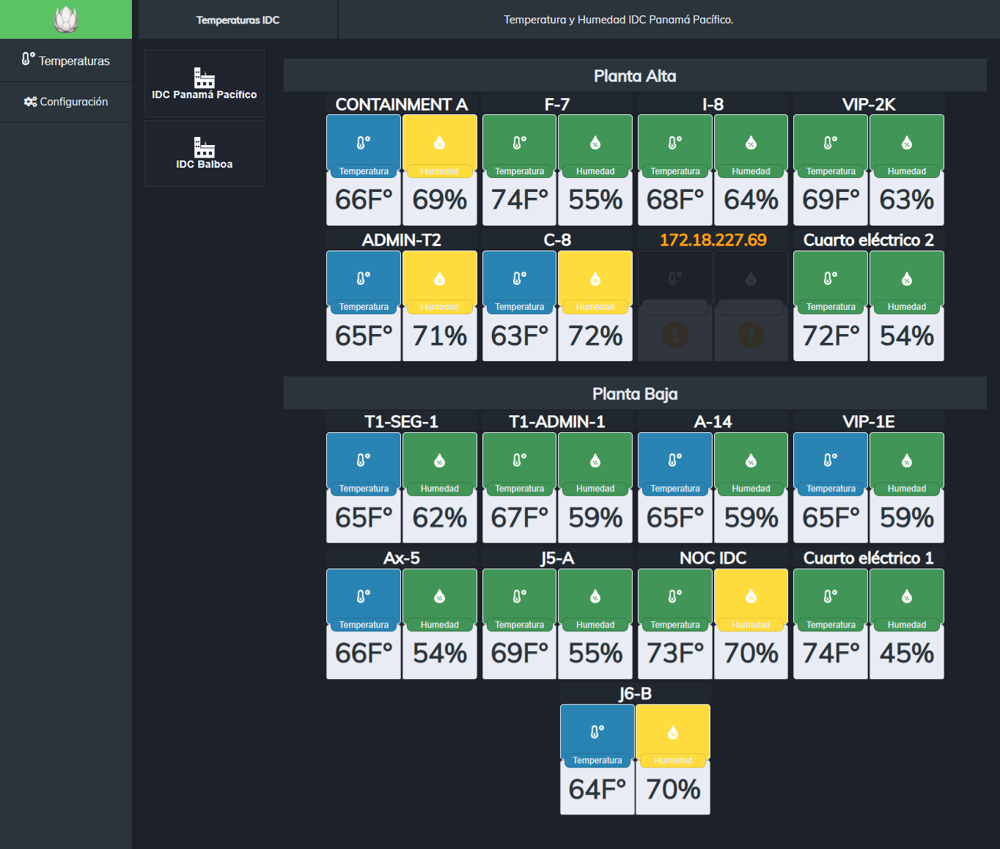

# PORTAL DE MONITOREO SNMP

### Features

- Frontend para monitoreo SNMP desarrollado en Javascript nativo.
- Dashboard flexible desarrollado en HTML5 con CSS tradicional sin ningún framewor externo. El dashboard para monitoreo tiene propiedades responsive;
- La aplicación cuenta con una vista que permite gestionar los dispositivos de red a monitorear. El monitoreo se hace con protocolo SNMP;
  - Soporta SNMPV1 y V2, dependiendo del dispositivo a monitorear.
- Monitore de dispositivos disponibles:
  - Sensores de temperatura y humedad.
- Inventario de sensores de temperatura y humedad: Permite añadir o remover las direcciones IP de los dispositivos a monitorear. ***las IP's de los sensores o equipos se almacenan   localmente en el backend: snmp_server***
- **Función de carga y autoreconexión con el backend:** La aplicación cuenta con pantalla de carga cuando inicia la conexión SNMP con los equipos de red a traves del backend, y    funcionalidad de reconexión con el backend en caso de perder la conexión con el servidor de NodeJS que no requiere intervención del usuario.
- Manejo de errores básico:
  - Pérdida de conexión con NodeJS.
  - Pérdida de conexión con los sensores.
    - Alerta visual cuando el sensor se cuelga o pierde conexión o sufre algún daño.
  - Alerta visual de reconexión mientras reconecta con el servidor SNMP.
  - Prevención de direcciones IP duplicadas.
______________________

### El código Javascript utiliza el siguiente formato de plantilla/estructura de diseño 

```javascript
(function(){
    var App = {
        config:{
            api:{}
        },
        htmlElements:{},
        init: function(){},
        events:{},
        utils:{}
    }
    App.init();
})();
```
_________

Capturas de pantalla:
-------------
### Dashboard principal.
Vista "sensores" para monitoreo de temperatura y humedad.

### Característica responsive.
Propiedad responsive para adaptarse a todo tipo de pantallas y dispositivos.

 
