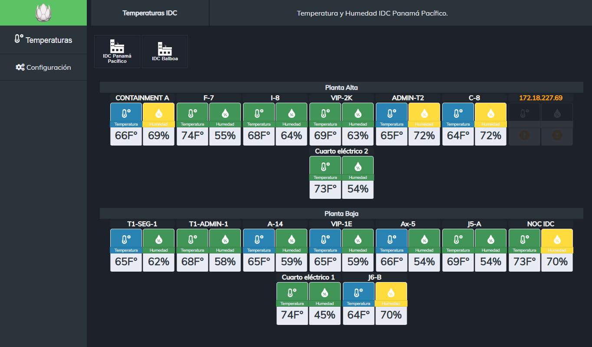
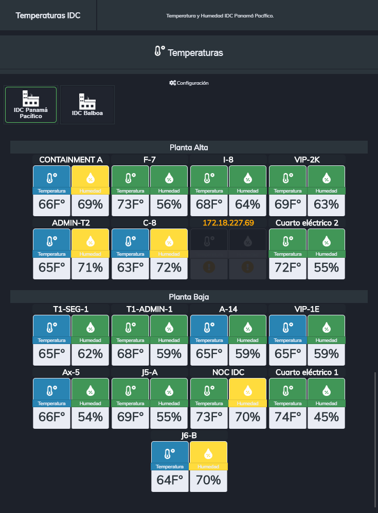
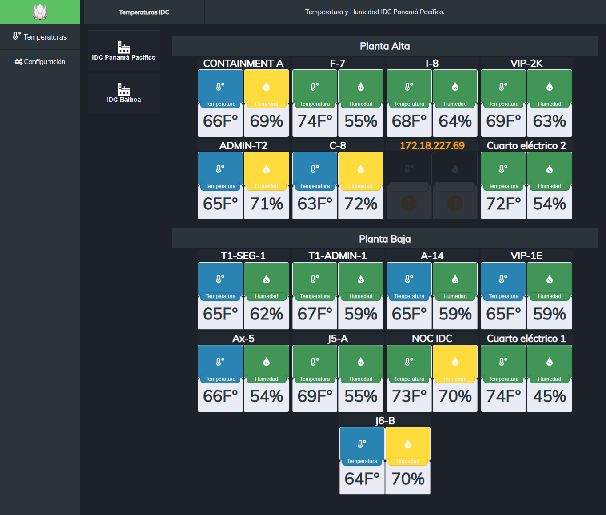
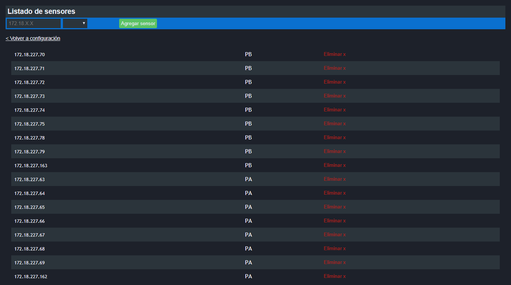
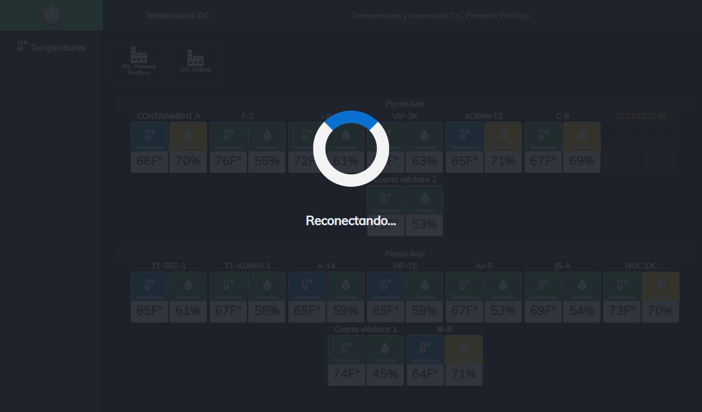

# PORTAL DE MONITOREO SNMP

TODO:
- BUG FUERTE CUANDO SE PIERDE CONEXIÓN CON UN SENSOR, SE QUEDA PEGADO EN LA PANTALLA Y NO HAY FORMA DE DARSE CUENTA.
- BUG FUERTE CUANDO NO PUEDE CONECTAR CON UN SENSOR DESDE EL INICIO, SOLO LO IGNORA DEL DASHBOARD, EN LUGAR DE MOSTRARLO COMO DEBERÍA

## Nota de despliegue actual

Esta version del frontend quedo ajustada para correr en el servidor `cwp-vidc-scat`, servida por Apache bajo:

```text
http://cwp-vidc-scat.cwpanama.com/snmp_manager/
```

El frontend ya no apunta directamente a `http://localhost:3000`. Las llamadas al backend usan rutas relativas bajo `/api`:

```javascript
baseUrl: "/api"
```

Apache debe tener configurado el proxy correspondiente:

```text
/api/... -> http://localhost:3000/...
```

Por eso, si este frontend se mueve a otro servidor o se abre sin Apache, hay que replicar el proxy `/api` o cambiar las URLs del frontend para apuntar al backend correcto.

Tambien se agrego versionado simple en `index.html` para evitar cache del navegador al desplegar cambios:

```html
main_V01.css?v=20260511-2
main_temps.js?v=20260511-2
```

El backend dockerizado queda documentado en `../snmp_server/README.md`.

### Features

- Frontend para monitoreo SNMP desarrollado en Javascript nativo.
- Dashboard flexible desarrollado en HTML5 con CSS tradicional sin ningún framewor externo. El dashboard para monitoreo tiene propiedades responsive;
- La aplicación cuenta con una vista que permite gestionar los dispositivos de red a monitorear. El monitoreo se hace con protocolo SNMP;
  - Soporta SNMPV1 y V2, dependiendo del dispositivo a monitorear.
- Monitore de dispositivos disponibles:
  - Sensores de temperatura y humedad.
- Inventario de sensores de temperatura y humedad: Permite añadir o remover las direcciones IP de los dispositivos a monitorear. ***las IP's de los sensores o equipos se almacenan   localmente en el backend: snmp_server***
- **Función de carga y autoreconexión con el backend:** La aplicación cuenta con pantalla de carga cuando inicia la conexión SNMP con los equipos de red a traves del backend, y    funcionalidad de reconexión con el backend en caso de perder la conexión con el servidor de NodeJS que no requiere intervención del usuario.
- Manejo de errores básico:
  - Pérdida de conexión con NodeJS.
  - Pérdida de conexión con los sensores.
    - Alerta visual cuando el sensor se cuelga o pierde conexión o sufre algún daño.
  - Alerta visual de reconexión mientras reconecta con el servidor SNMP.
  - Prevención de direcciones IP duplicadas.
______________________

### El código Javascript utiliza el siguiente formato de plantilla/estructura de diseño 

```javascript
(function(){
    var App = {
        config:{
            api:{}
        },
        htmlElements:{},
        init: function(){},
        events:{},
        utils:{}
    }
    App.init();
})();
```
_________

Capturas de pantalla:
-------------
### Dashboard principal.
Vista "Temperaturas" para monitoreo de temperatura y humedad.

### Propiedades responsive.
Propiedad responsive para adaptarse a todo tipo de pantallas y dispositivos.

 
### Base de datos de sensores
Listado de direcciones IP de dispositivos de red para administración/monitoreo SNMP.

### Reconexión automática
La aplicación tiene la capacidad de reconectar automaticamente con el servidor SNMP

